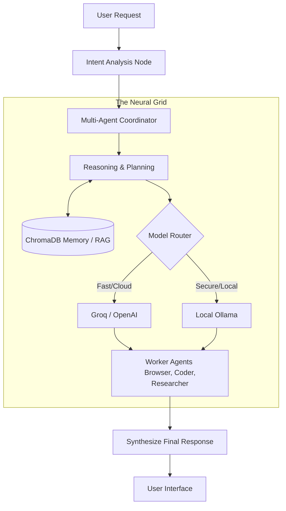

<div align="center">
  <h1>🧠 JARVIS AI Neural OS</h1>
  <p><b>A multi-agent, autonomous AI system that actually gets things done.</b></p>
</div>

<div align="center">
  
  
  
  
  
</div>

---

## 👋 What is this?

I built **JARVIS** because I wanted a single, unified AI assistant that does more than just chat. I wanted an AI that can actually browse the web, write and run code, remember what I told it last week, and automatically fall back to my local GPU when the Wi-Fi drops.

Under the hood, it's a complex multi-agent system powered by **LangGraph**. When you ask JARVIS a question, it doesn't just generate text—it routes your request to specialized worker agents (like a Browser agent, Researcher, or Coding agent) that collaborate to solve the problem.

---

## ✨ Why it's cool (Features)

* **Multi-Agent Routing:** It uses a master node to figure out exactly what you need, then spins up specialized agents to handle the heavy lifting.
* **Smart Model Fallbacks:** It runs on fast cloud models (Groq, OpenAI) by default. If those go down (or if I want complete privacy), it instantly falls back to my local **Ollama** instance. 
* **Long-Term Memory:** I integrated **ChromaDB** so JARVIS actually remembers context across different sessions. It's not just a goldfish with a context window.
* **Agentic Web Browsing:** It uses Playwright to autonomously navigate websites, scrape data, and synthesize answers in real-time.
* **Code Execution:** It doesn't just write Python; it can actually execute it safely to solve math or logic problems on the fly.

---

## 🏗️ How it works

I'm a big fan of visual architecture, so here's exactly how the data flows when you send a prompt:



---

## 💻 Tech Stack

I kept the stack modern and Python-heavy:
* **Core Logic:** Python, LangChain, LangGraph
* **LLMs:** Groq, OpenAI, Gemini, Ollama (Local)
* **Databases:** ChromaDB (Vector), SQLite (Relational)
* **Backend:** FastAPI, Flask
* **Automation:** Playwright (Async)

---

## 🛠️ Running it locally

Want to spin it up on your own machine? Here's how I set it up.

### Prerequisites
* Python 3.10+
* (Optional) A local [Ollama](https://ollama.com/) instance running in the background if you want local inference.
* API keys for Groq/OpenAI in a `.env` file.

### Installation

1. **Clone the repo**
   ```bash
   git clone https://github.com/hackwithayush/jarvis-ai-core.git
   cd jarvis-ai-core
   ```
2. **Install the dependencies**
   ```bash
   pip install -r requirements.txt
   ```
3. **Run the health check**
   I wrote a diagnostic script to make sure your API keys and LangGraph are playing nicely together before you start:
   ```bash
   python -m core.diagnostics
   ```
4. **Boot it up**
   ```bash
   ./Start_Jarvis_Systems.bat
   ```

---

## 🚀 What's next?

I'm currently treating this as version `16.0` of my personal setup. The next big things on my roadmap are improving the multimodal vision capabilities and tightening up the agent-to-agent communication loops. 

Feel free to fork it, break it, and build your own JARVIS!
